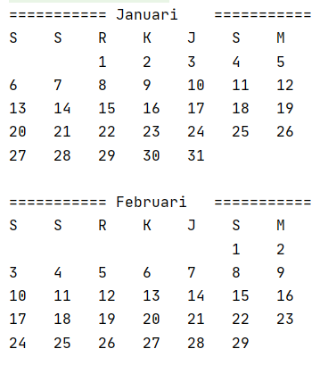
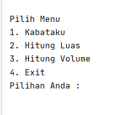

# Tugas GO-Lang


## 1. Kalender

disini saya mengunakan konsep :

* Array
* For


penampakan :



## 2. Kalkulator 

saya menggunkan:
   - struct & method
   - pointer
   - function

```
fitur :
- kali
- bagi
- tambah
- kurang
- akar
- pangkat
- luas persegi
- luas lingkaran
- volume tabung
- volume balok
- volume prisma
```


